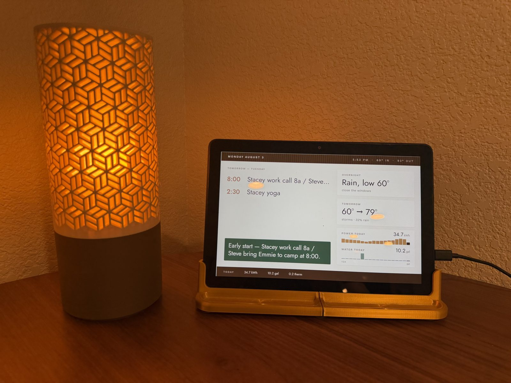
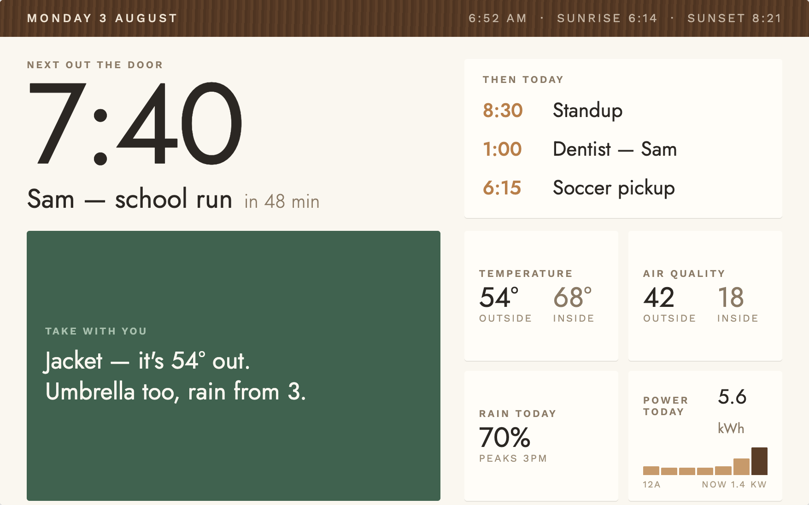
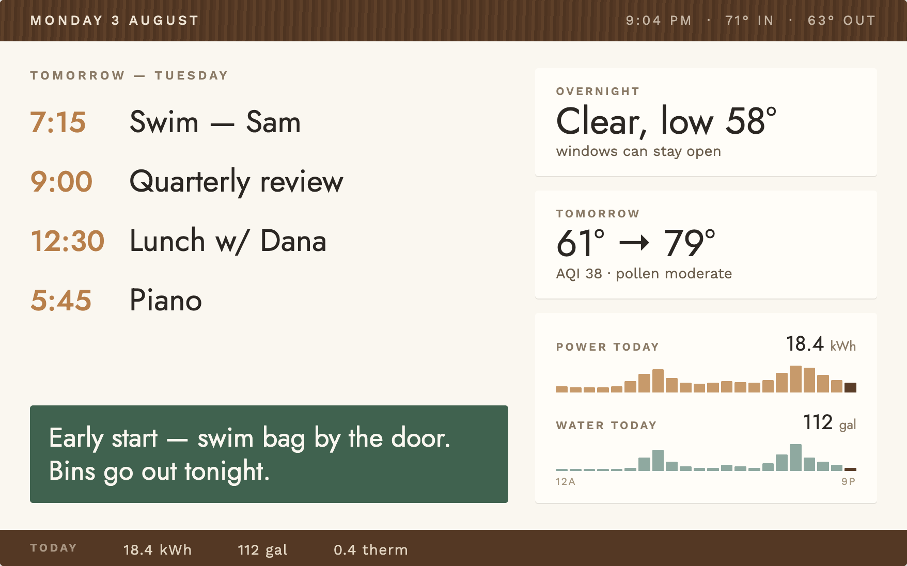
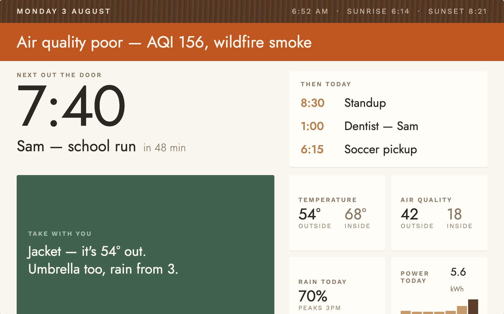

# Sideboard

A passive, furniture-grade day dashboard for a wall tablet, built as a Home Assistant add-on. It answers *"what is my day?"* — not "here are forty entity states." Three screens, switched automatically by time of day, designed to be read at a glance from across the kitchen:

- **Morning** — when do I need to leave, what do I wear, what's the rest of today
- **Evening** — what's tomorrow, what happens overnight, what did the house use today
- **Night** — a dimmed clock and nothing else, unless something is happening

Any screen can show an **alert band** (severe-weather warning, poor air quality, water leak) with a one-time chime when it appears. Nothing on screen is tappable; there is no interaction at all.



*Live on a Fire HD 10 in Fully Kiosk Browser.*

### The three screens

<p>
  
  
</p>
<p>
  
  
</p>

## Requirements

- Home Assistant OS or Supervised (anything with an add-on store)
- A **weather** integration that supports daily + hourly forecasts (Apple WeatherKit, Met.no, NWS, …)
- A **calendar** integration for your family calendar (CalDAV/iCloud, Google Calendar, Local Calendar)

Everything else is optional and degrades gracefully if absent: indoor temperature and AQI sensors, outdoor AQI (e.g. AirNow), daily energy/water meters, a cumulative gas meter, leak sensors, a bins/waste calendar, and an NWS alerts entity.

## Install

1. In Home Assistant go to **Settings → Add-ons → Add-on Store**.
2. Open the **⋮** menu (top right) → **Repositories**, paste
   `https://github.com/drkpxl/sideboard`
   and click **Add**.
3. Refresh the store page. **Sideboard** appears at the bottom under the new repository.
4. Open it → **Install**. (The image builds locally; give it a minute.)
5. Go to the add-on's **Configuration** tab and point the options at *your* entities — see the reference below. The defaults are one working household's setup and will not match yours.
6. **Start** the add-on, then open `http://<your-ha-host>:8090` in a browser. You should see the current screen with your data.

Authentication is handled through the Supervisor — the add-on never needs a token, and none of your credentials appear in its configuration.

## Configuration reference

| Option | What it is |
|---|---|
| `weather_entity` | Weather entity used for all forecasts (hourly rain, overnight low, tomorrow) |
| `outdoor_weather_entity` | Optional second weather entity (e.g. an NWS station) preferred for *current* outdoor temp/conditions; falls back to `weather_entity` |
| `indoor_temp_entity` | Indoor temperature sensor (pick one near the tablet) |
| `outdoor_aqi_entity` / `indoor_aqi_entity` | AQI sensors for the air-quality tile |
| `energy_today_entity` | A **daily** energy sensor that resets at midnight (a `utility_meter` helper works perfectly); drives the hourly bars and live kW |
| `water_today_entity` | Same idea for water |
| `gas_total_entity` | A **cumulative** gas meter; the day total is computed as the delta since midnight. ft³ meters are shown in therms, anything else in its own unit |
| `family_calendar` | The calendar for agenda, countdown, and "first up tomorrow" |
| `bins_source` | A `calendar.*` or `todo.*` entity holding waste-collection reminders. Event/item titles are matched for *trash / garbage / recycling / compost* keywords |
| `nws_alert_entity` | Optional sensor from the [NWS Alerts](https://github.com/finity69x2/nws_alerts) HACS integration; if set it becomes the warning source |
| `leak_sensors` | List of binary sensors that trigger the water-leak alert band |
| `morning_start/end`, `evening_start/end` | Day-part boundaries (HH:MM). Night is everything else; midday shows the screen chosen by `day_shows` |
| `prep_buffer_min` | Minutes before the next event that the countdown targets ("out the door" time) |
| `aqi_alert_threshold` | Outdoor AQI at which the alert band fires |
| `rain_prob_threshold` | Precipitation probability (%) that counts as "bring an umbrella" |
| `language` | Leave empty to use Home Assistant's language (English and Spanish shipped; contributions welcome) |
| `time_format` | `auto` (from locale), `12`, or `24` |
| `nws_alerts` | Built-in severe-weather polling of api.weather.gov (US only — turn off elsewhere, or set `nws_alert_entity` instead) |
| `nws_user_agent` | Contact string the NWS API asks for; put your email in it |

Units, locale, and timezone come from Home Assistant itself — a metric household in Spanish sees °C thresholds, `es` copy, and its own meter units with no extra setup.

## The bins calendar

Create a Local Calendar (or a Reminders/CalDAV calendar) in Home Assistant and add recurring events on the nights the bins go out, titled things like `Take out Trash` or `Take out Trash and Recycling`. Point `bins_source` at it. On collection night the morning footer shows *"Bins out tonight — trash & recycling"* and the evening prep block adds *"Bins go out tonight."* No events, no footer.

## Refresh model

The server polls Home Assistant (states every 20 s; calendars and meter history every 5 min; forecasts every 15 min) and pushes a ready-to-render viewmodel to the screen over Server-Sent Events — the tablet never polls. The clock and countdown tick locally every 15 s, day-part switches crossfade, the layout shifts a few pixels each hour against burn-in, and the page reloads itself nightly at 04:10. If data stops flowing for 15 minutes a small "data N min old" note appears in the corner. Add-on updates arrive through the normal add-on **Update** button when the repository version changes.

## Tablet setup (Fire HD or similar)

Run [Fully Kiosk Browser](https://www.fully-kiosk.com/) pointed at `http://<ha-host>:8090` with:

- **Autoplay audio: on** — required for the alert chime (stock browsers block audio without a touch)
- Keep screen on while plugged in; screensaver off
- Use Fully's scheduled brightness to dim the panel at night — the night screen is dark by design, but the backlight is yours to manage
- Optional: motion-triggered screen wake, remote admin

## Local development

```bash
# repo root
cp .env.example .env      # put a long-lived access token in it
node sideboard/server.js  # Node 22+, zero dependencies
```

`.env` needs `HA_LL_ACCESS_TOKEN=<token>` and optionally `HA_URL=http://homeassistant:8123`. Dev configuration lives in `local.config.json` (same shape the add-on options produce). Force screens while testing with `?screen=morning|evening|night` and `?alert=demo`.

